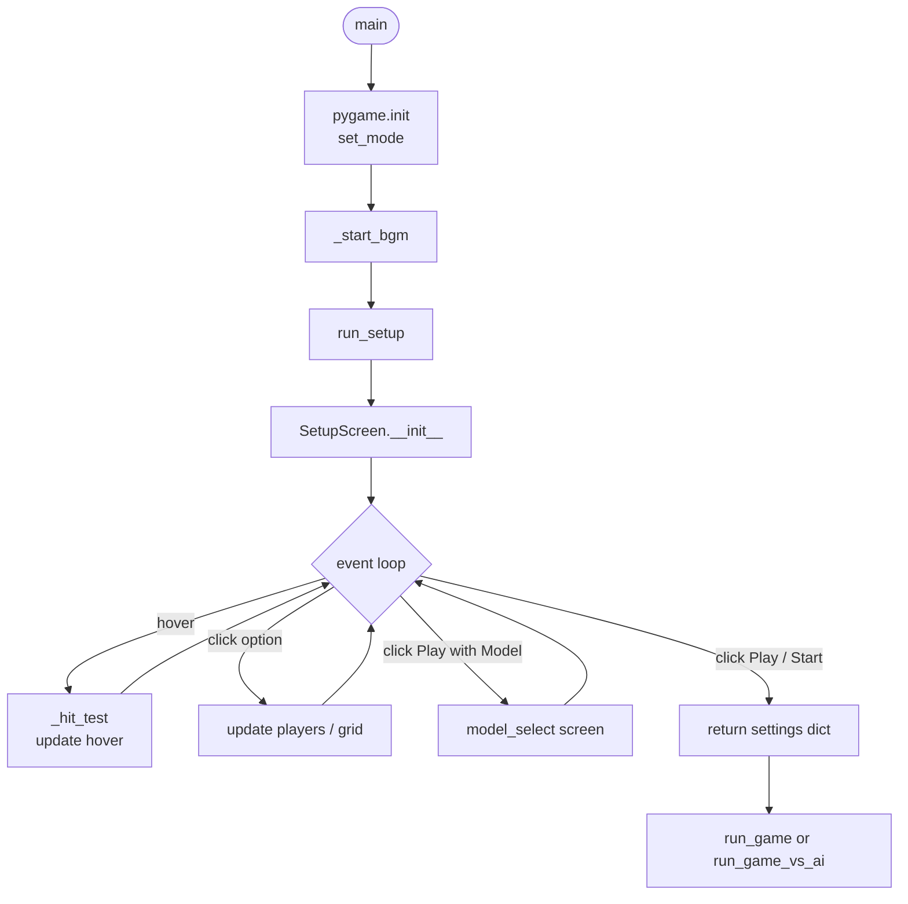
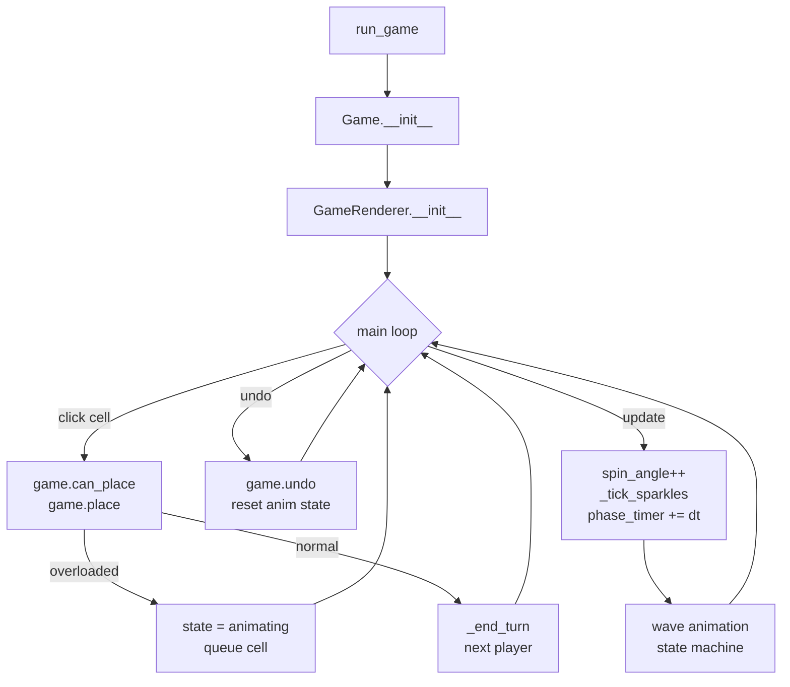
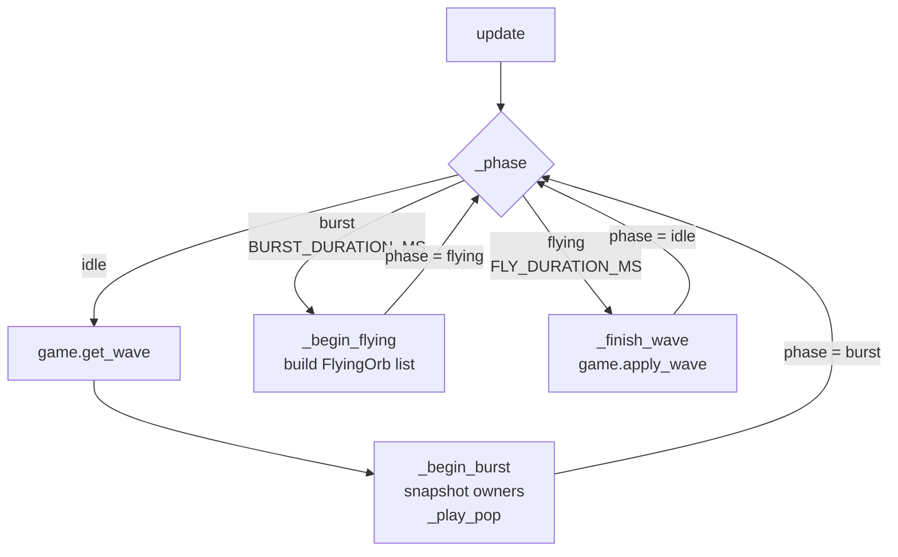
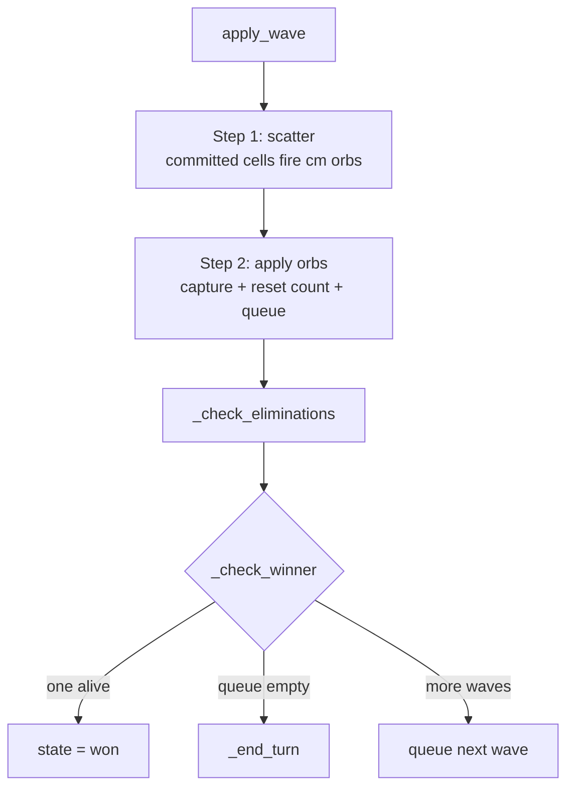
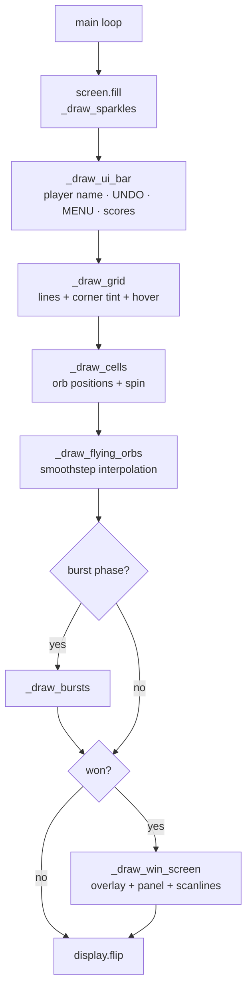

# Chain Reaction

> *"Sometimes the best projects start with nostalgia."*

---

## Introduction

When I was a kid, one of my favorite games to play with my cousins was Chain Reaction.
The concept was simple: take control of a grid, trigger chain reactions, and watch your cells spread across the board. Looking back, it was basically a battle royale of cells.

We're older now, and life is much busier than it used to be. It's not always easy to relive those moments and the happiness that came with them.

So I decided to revisit that childhood memory in the most engineer-like way possible.

I recreated the game in Python, implementing the core mechanics and adding a few customizations of my own. But after finishing it, I realized something — I had built the game, but I didn't have anyone around to play against.

That led me down a path I hadn't explored before: Reinforcement Learning.

What I thought would be a one- or two-day side project quickly turned into nearly five days of experimentation, debugging, redesigning reward structures, and refining decision-making logic. The final agent uses a combination of learned Q-values and custom filtering strategies to make its moves.

More importantly, this project introduced me to Reinforcement Learning from a hands-on perspective. It challenged me to think differently about problem solving, agent behavior, and training strategies.

In the end, I got more than just a playable AI opponent. I learned a new domain of AI, built something I'm genuinely proud of, and found a unique way to reconnect with a small piece of my childhood.

---

## What is Chain Reaction?

Chain Reaction is a turn-based strategy game played on a grid. Players alternate placing orbs on cells they own or on empty cells. When a cell accumulates enough orbs to reach its **critical mass** — equal to the number of its neighbours — it explodes, scattering orbs outward and potentially triggering a cascade of further explosions across the board.

The goal is to eliminate all other players by capturing every cell on the board.

[[Watch the demo](https://github.com/sudoVed/chain-reaction/releases/tag/video-v1.0)]
---

## Features

- **2–6 players** with distinct colours: Red, Blue, Green, Yellow, Magenta, Cyan
- **Configurable grid** — any size from 5×5 up to 12×12
- **Wave-based simultaneous explosions** — all queued blasts in a cascade fire at once per wave, so chain reactions look and feel correct
- **Flying orb animations** — orbs visibly travel to their target cells
- **Primed-cell spin** — cells one orb away from critical mass spin as a visual warning
- **Player elimination** — players with zero cells are knocked out mid-cascade
- **Undo** — revert any move via the UNDO button or `Z` / `U`
- **AI opponents** — Defensive, Greedy, and a trained DQN model
- **Cyber UI** — neon colour scheme with dynamic window resizing and sparkle background
- **BGM playlist** — two tracks alternating in a loop, plus per-explosion sound effects

For a deep dive into the AI and training pipeline, see [READMERL.md](rl/READMERL.md).

---

## Requirements

```
Python 3.10+
pygame        (Python ≤ 3.13)
pygame-ce     (Python 3.14+)
torch
numpy
```

**Windows — easiest way:** double-click `install.bat`. It detects your Python version, picks the right pygame variant, and installs everything automatically.

**Manual install:**
```bash
pip install -r requirements.txt
```

> If you are on Python 3.14+, also run `pip install pygame-ce` after the above (replaces pygame).

---

## Running the Game

**Option 1 — Terminal (any platform, shows errors if something goes wrong)**
```bash
cd ChainReaction
python main.py
```

**Option 2 — Double-click, no console window (Windows)**

Double-click `ChainReaction.pyw`. Windows automatically runs it with `pythonw.exe` if Python is installed. No terminal appears.

If double-clicking does nothing: right-click → *Open with* → Python.

**Option 3 — debug_run.bat (Windows, recommended for troubleshooting)**

Double-click `debug_run.bat`. Runs `python main.py` in a console window that stays open after exit, so any error messages are visible. Use this if the game silently fails to launch.

**Option 4 — Build your own .exe (Windows)**

If you want a double-clickable `.exe` that doesn't require a terminal:
```bash
pip install pyinstaller
build_exe.bat
```
This produces `ChainReaction.exe` in the same folder. The exe is a thin stub — it just finds `pythonw.exe` on your PATH and runs `main.py`. Re-run `build_exe.bat` only if `launcher_stub.py` changes; editing any other `.py` file takes effect immediately without a rebuild.

> **Note:** `ChainReaction.exe` is not included in this repo as it is platform-specific and will not run on another machine. Build it yourself using the steps above.

---

## Controls

| Input | Action |
|---|---|
| **Left click** a cell | Place an orb |
| **UNDO button** or `Z` / `U` | Undo last move |
| **MENU button** or `M` | Return to setup screen |
| `R` on win screen | Play again with same settings |
| `Esc` | Quit |

---

## Game Rules

1. On your turn, click any **empty cell** or a cell you **already own**.
2. Each click adds one orb. When a cell reaches its **critical mass** (corners = 2, edges = 3, interior = 4), it **explodes**.
3. An explosion scatters one orb to every neighbouring cell. Each scattered orb **immediately captures** its target cell for the attacker, regardless of whether the target was empty or enemy-owned.
4. If any neighbour reaches critical mass after being hit, it explodes in the **next wave** — forming a chain reaction.
5. All explosions queued in the same wave fire simultaneously before the next wave begins.
6. A player is **eliminated** the moment they own zero cells (after their first turn).
7. Last player standing **wins**.

---

## File Structure

```
ChainReaction/
│
├── main.py              Entry point — pygame init, BGM, setup and game loops
├── game.py              Pure game logic — grid, cascade, undo (no pygame)
├── renderer.py          All pygame drawing — cyber UI, board, wave animations
├── constants.py         Colour palette, timing constants, grid/player options
├── ai_player.py         AI wrapper — Defensive / Greedy / Smart (DQN) modes
│
├── assets/
│   ├── bgm.mp3          Background music track 1
│   ├── bgm2.mp3         Background music track 2
│   ├── bgmbad.mp3       Unused alternate track
│   ├── pop.mp3          Per-wave explosion sound
│   ├── icon.png         Window icon
│   └── icon.ico         Executable icon
│
├── rl/                  Reinforcement learning pipeline (see rl/READMERL.md)
│   ├── env.py           Gym-style environment wrapper
│   ├── model.py         Spatial CNN Q-network
│   ├── agent.py         DQNAgent — replay buffer, epsilon-greedy, train step
│   ├── policies.py      Fixed opponent policies (random, greedy, defensive)
│   ├── game_analysis.py Board analysis helpers — risk filter, exposure, clusters
│   ├── train.py         Full training loop — curriculum, reward shaping, checkpoints
│   ├── watch.py         Watch agents play with pygame display + BGM
│   ├── arena.py         Headless model-vs-model evaluation
│   └── debug_watch.py   Per-move reward breakdown visualiser
│
├── ChainReaction.pyw    Double-click launcher (no console window)
├── ChainReaction.exe    Thin stub exe — finds pythonw and runs main.py
├── build_exe.bat        Rebuilds ChainReaction.exe via PyInstaller
└── run.vbs              VBScript fallback launcher
```

---

## Architecture

The project is split into three clean layers:

| Layer | File | Responsibility |
|---|---|---|
| **Logic** | `game.py` | Grid state, placement rules, wave cascade, undo history |
| **Rendering** | `renderer.py` | Cyber setup screen, board drawing, wave animation state machine |
| **Entry point** | `main.py` | pygame init, BGM playlist, setup → game loop, AI integration |

`game.py` has **zero pygame imports** — it runs fully headless and is used directly by the RL training pipeline.

`renderer.py` calls `game.get_wave()` and `game.apply_wave()` to stay in sync with animation: the game state only advances once the flying-orb animation completes, so the visual and logical states are always consistent.

---

## Program Flow

### Startup and Setup Screen



### Game Loop



### Wave Animation State Machine



### apply_wave — Cascade Logic



### Draw Pipeline



---

## Key Design Decisions

**Wave-based simultaneous explosions**
All queued blasts fire at once per wave rather than sequentially. Sequential processing would let a single cell chain-capture a whole row before a parallel source gets its turn, which breaks the game's symmetry.

**Capture on contact**
Any orb landing on any cell — empty or enemy — immediately converts it to the attacker's colour, even if it does not subsequently explode. This is the correct Chain Reaction rule and was a critical bug fix during development.

**Checking for winner mid-cascade**
A densely packed single-colour board can sustain indefinite same-player cascades. Checking for a winner after every wave exits the loop the instant only one player remains.

**committed_explosions**
When a cell first overloads mid-wave, its count resets to 0 and it queues for the next wave. Without a committed set, the burst/fly animation phase would see count=0 and skip it, killing the visual. The committed flag forces the animation to include it unconditionally.

**Undo system**
Before every `place()` call, `game._snapshot()` saves the complete board state to `game.history`. `game.undo()` pops the stack and calls `_restore()` to rewind exactly. The renderer clears all animation state on undo so no ghost orbs remain.

---

## AI Opponents

Three difficulty levels are available from the setup screen:

| Mode | Description |
|---|---|
| **Defensive** | Avoids placing next to enemy primed cells; builds safe chains |
| **Greedy** | Aggressively fires primed cells and prioritises chain captures |
| **Smart** | Trained DQN model with self-aware risk filtering |

The Smart agent uses a fully-convolutional Q-network trained over ~10,000 episodes across a four-stage curriculum, achieving 95% win rate vs random, 81.5% vs defensive, and 57% vs greedy. It applies a self-simulation risk filter: before committing to any move, it asks *"what would I do in the opponent's position after this move?"* and avoids trades where the answer is damaging.

For the full technical writeup — network architecture, state encoding, reward shaping, curriculum design, and arena results — see [READMERL.md](rl/READMERL.md).

---

*Built with Python, pygame, and PyTorch.*
